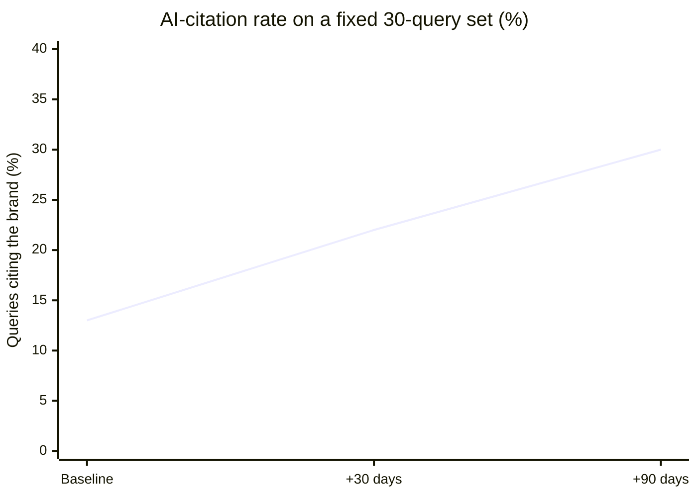

<h1 align="center">
  <a href="https://github.com/OndrejKnedla/seo-geo-playbook-ok">
    
  </a>
  <br>
  <small>Rank in Google and get cited by ChatGPT, Perplexity, Gemini and Claude, shipped as Claude Code skills</small>
</h1>

<p align="center">
  <a href="https://github.com/OndrejKnedla/seo-geo-playbook-ok/actions/workflows/ci.yml"></a>
  
  
  
  
  <a href="LICENSE"></a>
</p>

<p align="center">
  <b>English</b> &nbsp;·&nbsp; <a href="README.zh.md">中文</a>
</p>

<p align="center">
  <a href="#results">Results</a> &nbsp;·&nbsp;
  <a href="#try-the-audit">Try the audit</a> &nbsp;·&nbsp;
  <a href="#whats-inside">What's inside</a> &nbsp;·&nbsp;
  <a href="#use-it-as-a-claude-code-plugin">Plugin</a> &nbsp;·&nbsp;
  <a href="#the-gotchas-that-cost-the-most">Gotchas</a> &nbsp;·&nbsp;
  <a href="#who-its-for">Who it's for</a>
</p>

---

> ### The one idea that reorders everything
> On-page SEO/GEO can be maxed out in weeks. After that, the ceiling is a single thing: your off-site
> brand-mention footprint. Brand mentions correlate with AI visibility roughly **3x more strongly than
> backlinks** (Ahrefs, Dec 2025). A young brand wins branded and niche queries almost immediately and
> loses the generic high-value ones, not on content but on independent authority. More pages will not
> close that gap. Independent mentions will.

---

## Results

Measured on a real launch, with a fixed 30-query test set re-run on a schedule and two independent
audit passes that converged on the same diagnosis.

| Checkpoint | Metric | Result |
|------------|--------|--------|
| Baseline | AI-citation rate (fixed 30-query set) | ~13% (4 / 30) |
| +30 days | AI-citation rate, after on-page work | ~22% |
| +90 days | AI-citation rate, after off-site footprint | 30%+ |
| Week 1 | On-page SEO health (7 categories) | 64 to maxed after fixes |
| Week 2 | GEO score (6 dimensions) | ~61 / 100 |
| Ongoing | Branded and niche queries | #1, owned |



The shape is the entire thesis: on-page work moves the line fast, then plateaus in the low 20s. The
climb past the plateau is bought off-site, with brand mentions, not with more pages. Full method and
data in [`references/GEO-ADOPTION.md`](references/GEO-ADOPTION.md).

## Why this is worth doing now

Search is splitting in two. People still Google, but a growing share now ask an AI and read the
synthesized answer instead of clicking ten blue links. When the AI answers, it cites a handful of
sources. If you are not one of them, you do not exist for that query, and there is no page 2 to climb.

The research behind that shift (sources and caveats in
[`references/statistics-2026.md`](references/statistics-2026.md)):

- **58 to 60% of Google searches already end without a click** (Semrush / SparkToro, 2022 to 2024); AI Overviews push that higher.
- **Domain Rating, the classic backlink signal, barely predicts AI citations** (~0.27 correlation). The thing you optimized for a decade is the wrong lever here.
- **Brand mentions predict AI visibility ~3x more strongly than backlinks** (Ahrefs, Dec 2025), and engines cite Reddit, YouTube and LinkedIn most ([SearchEngineLand, 2025](https://searchengineland.com/ai-search-engines-cite-reddit-youtube-and-linkedin-most-study-473138)).

On the page itself, the formats that measurably lift citations (directional, from 2026 GEO studies):

| Format | Measured lift |
|--------|---------------|
| Answer-first content (the answer in the first paragraph) | ~4.8x more citations |
| Comparison tables | ~2.8x |
| FAQ blocks | +156% |
| In-text citations to sources | +115% visibility |
| Statistics with a named denominator | +40% citation rate |
| Long-form with real depth (2000+ words) | ~3x |

## Try the audit

Node 18+, nothing to install. It reads the page the way an AI crawler does, from the server HTML
rather than the browser DOM, because the two differ and that gap is where visibility quietly dies:

```bash
npx github:OndrejKnedla/seo-geo-playbook-ok https://www.anthropic.com --max-pages=6
# or, after cloning:  node skills/seo-geo-audit/scripts/audit.mjs https://www.anthropic.com
```

```
  FOUNDATIONAL SCORE: 78/100  ->  GRADE C
  By category (worst first):
    ░░░░░░░░░░░░░░░░░░░░   0  E-E-A-T
    ███████░░░░░░░░░░░░░  36  Structured Data
    ████████████░░░░░░░░  61  AI/GEO
    █████████████████░░░  86  Core SEO
  FAILS:
    [Structured Data] jsonld-present, 17% of pages ship JSON-LD in the SERVER HTML
    [AI/GEO]          geo-answer-first, 0% of pages open with an answer block
```

That score is half the grade. The other half comes from Claude reading the pages against a
[6-dimension citability rubric](skills/seo-geo-audit/references/INTELLIGENCE-RUBRIC.md): deterministic
where it can be, judged where it has to be.

## What's inside

| Skill | What it does |
|-------|--------------|
| **seo-geo-audit** | Crawls the server HTML, runs ~28 deterministic checks plus the 6-dimension rubric, and returns an A to F grade with a prioritized fix list. Includes a render-gap check: content that appears only after JavaScript is invisible to AI crawlers. |
| **generate-llms-txt** | Drafts a curated `/llms.txt` from your sitemap, ready to trim. |
| **track-ai-citations** | A rigorous method for measuring whether ChatGPT, Perplexity and Gemini actually cite you, re-tested over time. |
| **seo-geo-fix** | Applies one focused fix (SSR JSON-LD, canonical, schema, headings) as a small, reviewable PR. |
| **geo-charts** | Renders the numbers as a single-file HTML chart you can screenshot. |

Also included: four [agents](agents/) (on-page SEO, GEO monitoring, a strict pre-merge reviewer, a
trend watcher), a [GitHub Action](.github/workflows/geo-audit.yml) that gates deploys on the score, a
[chunk-level citability simulator](skills/seo-geo-audit/scripts/chunk-sim.mjs), and an optional
[DataForSEO toolkit](tools/dataforseo) (Python) for real audit, keyword, SERP and competitor reports.

## Use it as a Claude Code plugin

```
/plugin marketplace add OndrejKnedla/seo-geo-playbook-ok
/plugin install seo-geo-playbook-ok
```

Then ask Claude to "audit example.com for SEO and GEO", "draft an llms.txt for my site", or "check
whether ChatGPT cites us".

## The gotchas that cost the most

In rough order of pain. Full detail in the [playbook](references/PLAYBOOK.md):

1. **Client-side JSON-LD is invisible to AI crawlers.** It must be in the server HTML. Verify with `curl`, not the browser.
2. **A global `canonical: '/'` in a root layout** silently canonicalizes every subpage into the homepage.
3. **Blocking AI crawlers in robots.txt, usually by accident.** The [exact user-agents](references/ai-crawlers.md) to allow.
4. **`Disallow` plus `noindex` together is a dead end:** the page is never read, so it is never deindexed.
5. **The same fact written two ways** (a price, a stat) gets you cited wrong and erodes trust.

## How it was measured

No theory pulled from blog posts. Findings were scored live against production:

- An SEO-weighted pass (technical, content, on-page, schema, performance, images) producing a 0 to 100 health score.
- A GEO-weighted pass (citability, brand authority, E-E-A-T, technical GEO, schema, platform fit).
- A fixed 30-query citation baseline tested in ChatGPT and Perplexity, incognito, re-run at +30 and +90 days.
- Optional real ranking and keyword data via the [DataForSEO toolkit](tools/dataforseo).

## Who it's for

- **Founders and indie hackers** who need to be found by AI search before competitors with a decade of backlinks wake up.
- **In-house and freelance SEOs** moving into GEO who want a measured method, not vibes.
- **Engineers** who would rather run a script and read a diff than buy another dashboard.

It is **not** a rank-tracking SaaS, a link-buying service, or a black-hat kit. The core is read-only,
runs locally, and stays within search-engine and AI guidelines.

## Going deeper

- [`references/PLAYBOOK.md`](references/PLAYBOOK.md): the full set of lessons and gotchas.
- [`references/GEO-ADOPTION.md`](references/GEO-ADOPTION.md): adoption data and the citation-rate curve.
- [`references/statistics-2026.md`](references/statistics-2026.md): the numbers worth quoting, with sources, and the ones removed because they did not hold up.
- [`references/geo-frontier-strategies.md`](references/geo-frontier-strategies.md): seven GEO strategies built on how AI engines actually retrieve and cite.
- [`references/tactics-spectrum.md`](references/tactics-spectrum.md): the white, gray and black-hat map, written for recognition and defense (this repo stays white-hat).
- [`references/ai-crawlers.md`](references/ai-crawlers.md) and [`references/platform-profiles/`](references/platform-profiles): per-engine detail.
- [`references/data-providers.md`](references/data-providers.md): adding real SERP, keyword and rank data.

## Sources

Zero-click from Semrush / SparkToro (2022 to 2024). Correlation figures from the Ahrefs brand-mentions
vs AI-visibility study (Dec 2025) and [SearchEngineLand](https://searchengineland.com/ai-search-engines-cite-reddit-youtube-and-linkedin-most-study-473138)
(2025). On-page lift figures from 2026 GEO/AEO content studies. Figures are as publicly reported and
approximate; see [`references/statistics-2026.md`](references/statistics-2026.md) for detail and caveats.

## Author

Built and maintained by **Ondrej Knedla (OK)**. Distilled from real, measured SEO/GEO work and kept
deliberately practical. Issues and PRs welcome, see [`CONTRIBUTING.md`](CONTRIBUTING.md).

## License

[MIT](LICENSE). Take what is useful.

---

<div align="center">
<sub>Built by <a href="https://github.com/OndrejKnedla">Ondrej Knedla (OK)</a>.</sub>
</div>
