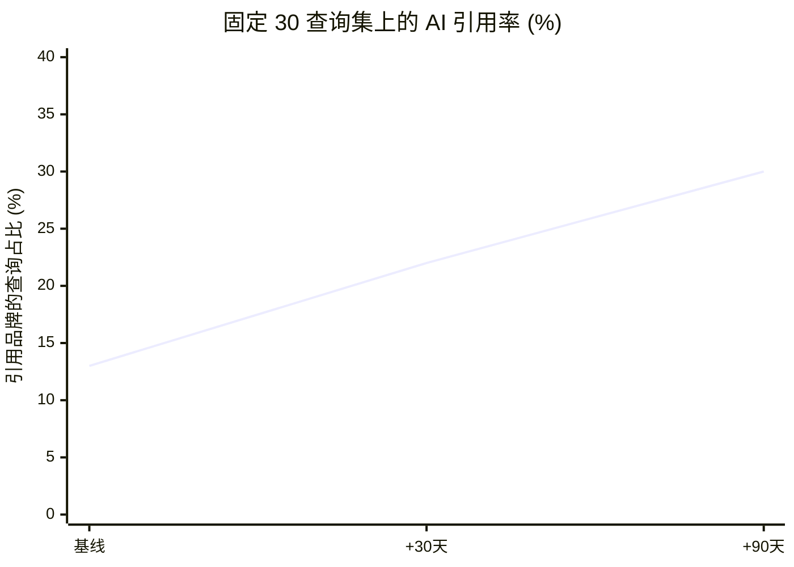

<h1 align="center">
  <a href="https://github.com/OndrejKnedla/seo-geo-playbook-ok">
    
  </a>
  <br>
  <small>在 Google 获得排名，并被 ChatGPT、Perplexity、Gemini 和 Claude 引用，以 Claude Code skills 形式交付</small>
</h1>

<p align="center">
  <a href="https://github.com/OndrejKnedla/seo-geo-playbook-ok/actions/workflows/ci.yml"></a>
  
  
  
  
  <a href="LICENSE"></a>
</p>

<p align="center">
  <a href="README.md">English</a> &nbsp;·&nbsp; <b>中文</b>
</p>

---

> ### 一个能重排一切优先级的核心观点
> 页面内（on-page）的 SEO/GEO 几周内就能做到极致。此后真正的天花板只有一个：你在站外的品牌提及（brand mention）规模。品牌提及与 AI 可见度的相关性大约是反向链接（backlinks）的 **3 倍**（Ahrefs，2025 年 12 月）。一个年轻品牌几乎能立刻赢下品牌词和细分长尾词，却会输掉那些高价值的通用词，原因不在内容，而在缺乏独立的权威背书。更多页面无法弥补这个差距，独立的品牌提及才行。

---

## 成果

在一次真实上线中测得：使用固定的 30 个查询测试集按计划复测，并由两套相互独立的审计方法得出了一致的诊断。

| 检查点 | 指标 | 结果 |
|--------|------|------|
| 基线 | AI 引用率（固定 30 查询集） | ~13%（4 / 30） |
| +30 天 | 完成页面内优化后的 AI 引用率 | ~22% |
| +90 天 | 建立站外提及后的 AI 引用率 | 30%+ |
| 第 1 周 | 页面内 SEO 健康度（7 个类别） | 修复后由 64 提升至满分 |
| 第 2 周 | GEO 评分（6 个维度） | ~61 / 100 |
| 持续 | 品牌词与细分长尾词 | 第 1 名，牢牢占据 |



这条曲线的形状就是全部论点：页面内的工作能让曲线快速上升，然后在 20% 出头处趋平。越过平台期靠的是站外的品牌提及，而不是更多页面。完整方法与数据见 [`references/GEO-ADOPTION.md`](references/GEO-ADOPTION.md)。

## 为什么现在值得做

搜索正在一分为二。人们仍在用 Google，但越来越多的人开始直接问 AI，读取综合后的答案，而不再点开十条蓝色链接。当 AI 给出答案时，它只会引用少数几个来源。如果你不在其中，对那个查询而言你就不存在，而且没有第二页可爬。

支撑这一转变的研究（来源与注意事项见 [`references/statistics-2026.md`](references/statistics-2026.md)）：

- **Google 上 58% 到 60% 的搜索已经没有任何点击**（Semrush / SparkToro，2022 到 2024 年），而 AI Overviews 会进一步抬高这一比例。
- **Domain Rating（经典的反向链接信号）几乎无法预测 AI 引用**（相关性约 0.27）。你优化了十年的东西，在这里是错的杠杆。
- **品牌提及对 AI 可见度的预测力约为反向链接的 3 倍**（Ahrefs，2025 年 12 月），而引擎引用最多的是 Reddit、YouTube 和 LinkedIn（[SearchEngineLand，2025](https://searchengineland.com/ai-search-engines-cite-reddit-youtube-and-linkedin-most-study-473138)）。

在页面本身，可量化提升引用率的内容形式（方向性结论，源自 2026 年的 GEO 研究）：

| 形式 | 实测提升 |
|------|----------|
| 答案前置（第一段就给出答案） | 引用约多 4.8 倍 |
| 对比表格 | 约 2.8 倍 |
| FAQ 区块 | +156% |
| 文中标注来源引用 | 可见度 +115% |
| 带明确分母的统计数据 | 引用率 +40% |
| 有真正深度的长文（2000+ 词） | 约 3 倍 |

## 试试审计

只需 Node 18+，无需安装。它以 AI 爬虫的方式读取页面：读取服务端 HTML，而不是浏览器 DOM，因为两者不同，而这道缝隙正是可见度悄悄流失之处：

```bash
npx github:OndrejKnedla/seo-geo-playbook-ok https://www.anthropic.com --max-pages=6
# 或克隆后运行： node skills/seo-geo-audit/scripts/audit.mjs https://www.anthropic.com
```

```
  FOUNDATIONAL SCORE: 78/100  ->  GRADE C
  By category (worst first):
    ░░░░░░░░░░░░░░░░░░░░   0  E-E-A-T
    ███████░░░░░░░░░░░░░  36  Structured Data
    ████████████░░░░░░░░  61  AI/GEO
    █████████████████░░░  86  Core SEO
  FAILS:
    [Structured Data] jsonld-present, 17% of pages ship JSON-LD in the SERVER HTML
    [AI/GEO]          geo-answer-first, 0% of pages open with an answer block
```

这个分数只是评分的一半。另一半来自 Claude 依据 [6 维可引用性评分标准](skills/seo-geo-audit/references/INTELLIGENCE-RUBRIC.md) 阅读页面后给出的判断：能确定的部分用确定性检查，必须判断的部分由模型判断。

## 包含哪些内容

| Skill | 作用 |
|-------|------|
| **seo-geo-audit** | 爬取服务端 HTML，运行约 28 项确定性检查加 6 维评分标准，输出 A 到 F 的评分和按优先级排序的修复清单。包含 render-gap 检查：只有在 JavaScript 执行后才出现的内容对 AI 爬虫是不可见的。 |
| **generate-llms-txt** | 根据你的 sitemap 生成一份精选的 `/llms.txt` 草稿，便于精简。 |
| **track-ai-citations** | 一套严谨的方法，用于衡量 ChatGPT、Perplexity 和 Gemini 是否真的引用你，并定期复测。 |
| **seo-geo-fix** | 以小型、可审阅的 PR 形式应用一处针对性修复（服务端 JSON-LD、canonical、schema、标题层级）。 |
| **geo-charts** | 把数据渲染成可截图的单文件 HTML 图表。 |

此外还包括：四个 [agents](agents/)（页面内 SEO、GEO 监测、严格的合并前审查、趋势观察），一个可按评分卡住部署的 [GitHub Action](.github/workflows/geo-audit.yml)，一个 [chunk 级可引用性模拟器](skills/seo-geo-audit/scripts/chunk-sim.mjs)，以及一个可选的 [DataForSEO 工具包](tools/dataforseo)（Python），用于生成真实的审计、关键词、SERP 和竞品报告。

## 作为 Claude Code 插件使用

```
/plugin marketplace add OndrejKnedla/seo-geo-playbook-ok
/plugin install seo-geo-playbook-ok
```

然后让 Claude “audit example.com for SEO and GEO”、“draft an llms.txt for my site”，或“check whether ChatGPT cites us”。

## 代价最高的那些坑

大致按踩坑之痛排序。完整细节见 [playbook](references/PLAYBOOK.md)：

1. **客户端注入的 JSON-LD 对 AI 爬虫不可见。** 它必须在服务端 HTML 里。用 `curl` 验证，而不是浏览器。
2. **根布局里一个全局的 `canonical: '/'`** 会悄悄把每个子页面 canonical 到首页。
3. **在 robots.txt 里屏蔽 AI 爬虫，通常是无意的。** 应放行的[确切 user-agent 列表](references/ai-crawlers.md)。
4. **`Disallow` 加 `noindex` 同时存在是死路：** 页面永远不会被读取，因此也永远不会被移出索引。
5. **同一事实写成两个版本**（价格、某个数据）会让你被错误引用，并侵蚀信任。

## 是如何测量的

没有从博客里抄来的理论。所有结论都是对生产环境实测得出：

- 一套以 SEO 为权重的评估（技术、内容、页面内、schema、性能、图片），产出 0 到 100 的健康度评分。
- 一套以 GEO 为权重的评估（可引用性、品牌权威、E-E-A-T、技术 GEO、schema、平台适配）。
- 一个固定的 30 查询引用基线，在 ChatGPT 和 Perplexity 的无痕模式下测试，并在 +30 与 +90 天复测。
- 通过 [DataForSEO 工具包](tools/dataforseo) 可选地获取真实排名与关键词数据。

## 适合谁

- **创始人与独立开发者**：希望在拥有十年反向链接的对手反应过来之前，先被 AI 搜索找到。
- **企业内与自由职业 SEO**：正在转向 GEO，想要可衡量的方法，而不是凭感觉。
- **工程师**：宁愿运行脚本、读 diff，也不想再买一个仪表盘。

它**不是**排名追踪 SaaS、买链接服务，也不是黑帽工具包。核心只读、本地运行，并遵守搜索引擎与 AI 的规则。

## 深入了解

- [`references/PLAYBOOK.md`](references/PLAYBOOK.md)：完整的经验与坑点。
- [`references/GEO-ADOPTION.md`](references/GEO-ADOPTION.md)：采用度数据与引用率曲线。
- [`references/statistics-2026.md`](references/statistics-2026.md)：值得引用的数字及其来源，以及那些因站不住脚而被移除的数字。
- [`references/geo-frontier-strategies.md`](references/geo-frontier-strategies.md)：基于 AI 引擎实际检索与引用方式的七条 GEO 策略。
- [`references/tactics-spectrum.md`](references/tactics-spectrum.md)：白帽、灰帽与黑帽全景图，为识别与防御而写（本仓库坚持白帽）。
- [`references/ai-crawlers.md`](references/ai-crawlers.md) 与 [`references/platform-profiles/`](references/platform-profiles)：各引擎的细节。
- [`references/data-providers.md`](references/data-providers.md)：接入真实的 SERP、关键词与排名数据。

## 来源

零点击数据来自 Semrush / SparkToro（2022 到 2024 年）。相关性数字来自 Ahrefs 品牌提及与 AI 可见度研究（2025 年 12 月）以及 [SearchEngineLand](https://searchengineland.com/ai-search-engines-cite-reddit-youtube-and-linkedin-most-study-473138)（2025 年）。页面内提升数字来自 2026 年的 GEO/AEO 内容研究。数字均为公开报告的近似值，详情与注意事项见 [`references/statistics-2026.md`](references/statistics-2026.md)。

## 作者

由 **Ondrej Knedla (OK)** 构建与维护。提炼自真实、可衡量的 SEO/GEO 实战，刻意保持实用。欢迎 issue 与 PR，见 [`CONTRIBUTING.md`](CONTRIBUTING.md)。

## 许可

[MIT](LICENSE)。取你所需。

---

<div align="center">
<sub>由 <a href="https://github.com/OndrejKnedla">Ondrej Knedla (OK)</a> 构建。</sub>
</div>
