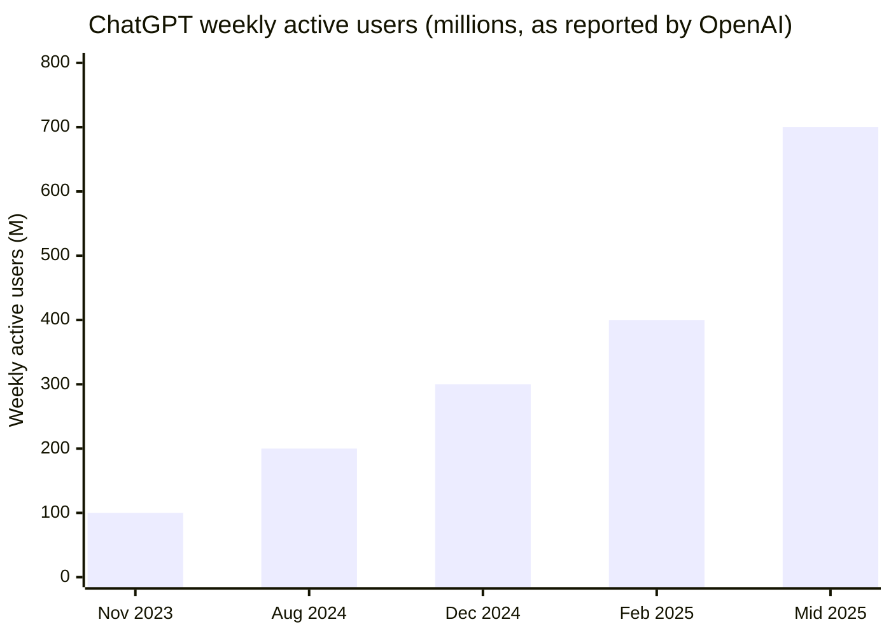
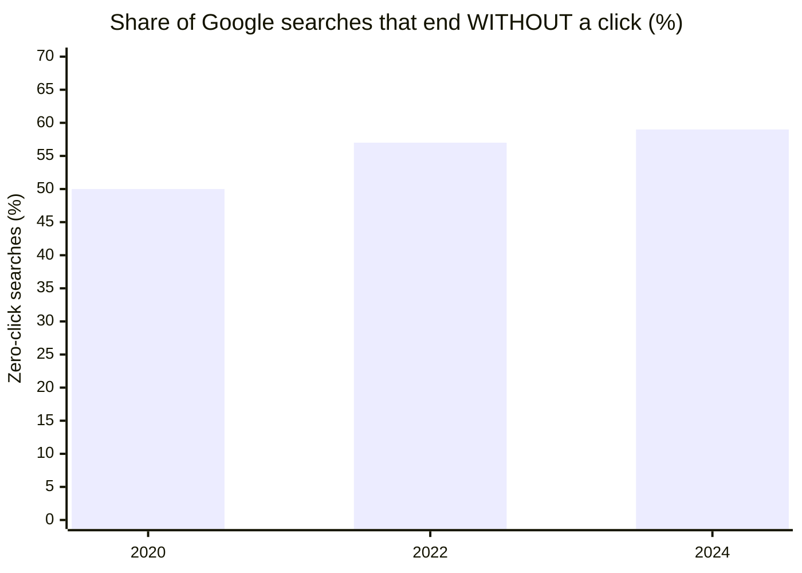
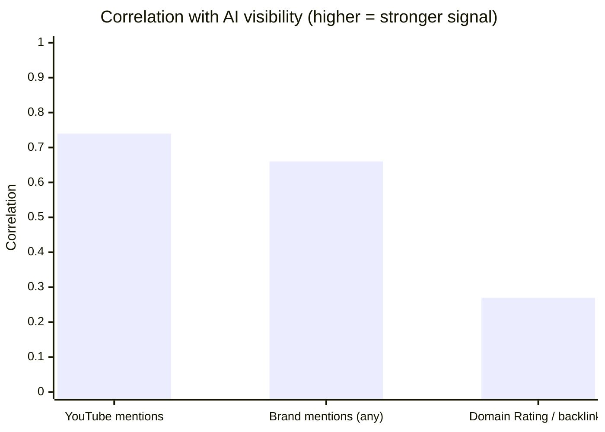
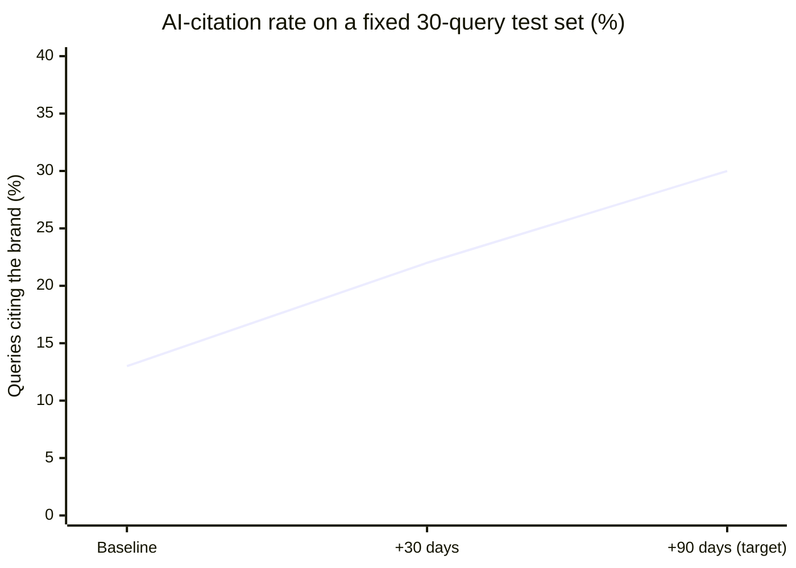

# 📊 GEO adoption: the data behind why this matters

Why optimize for AI answers at all? Because that's where the audience is moving. This page collects
the public numbers and studies that make the case, plus the one chart that matters most: **how a
brand's AI-citation rate actually improves once you do the work.**

> ⚠️ **On the numbers:** figures below are *as publicly reported* by the named sources and are
> rounded / approximate. They're here to show direction and order of magnitude, not to be quoted to
> the decimal. Sources are linked so you can check the latest.

---

## 1. AI assistants went from niche to default, fast

ChatGPT's weekly active users, as announced by OpenAI at each milestone:

- **ChatGPT:** ~100M weekly (Nov 2023) → 300M (Dec 2024) → 400M (Feb 2025) → **~700M+ weekly (2025)**,
  per OpenAI announcements.
- **Google AI Overviews:** launched May 2024; Google reported **1.5B monthly users** by mid-2025
  (Google I/O). AI answers now sit *above* the classic blue links for a huge share of queries.
- **Perplexity:** grew to **hundreds of millions of queries per month** through 2024-2025.
- **Gemini, Copilot, Claude:** all shipping search-grounded answers to hundreds of millions more.

**Takeaway:** "AI search" is no longer a fringe channel. For a growing slice of your audience, the AI
answer *is* the search result.

---

## 2. The click is disappearing

- **~58-60% of Google searches end without a click** (Semrush / SparkToro zero-click studies,
  2022-2024), and AI Overviews push that higher by answering on the page.
- **Gartner forecast:** traditional search engine volume could **drop ~25% by 2026** as users shift
  to AI assistants and chatbots.

**Takeaway:** ranking #1 means less every year if the answer is synthesized above you. Being *cited
inside* the answer is the new click.

---

## 3. The ranking signals are not the ones you optimized for

What actually predicts whether an AI cites you (correlation strength, Ahrefs brand-mentions study,
Dec 2025):

- **Brand mentions correlate ~3× more strongly than backlinks.**
- **Domain Rating (classic backlink authority) is weak** (~0.27) for AI citations.
- AI engines cite **Reddit, YouTube and LinkedIn the most**
  ([SearchEngineLand study, 2025](https://searchengineland.com/ai-search-engines-cite-reddit-youtube-and-linkedin-most-study-473138)).

**Takeaway:** the off-site mention footprint that most teams ignore is the single biggest lever, and
it's exactly where a new brand can out-maneuver an incumbent with a decade of backlinks but no GEO
discipline.

---

## 4. The chart that matters most: citation rate improves when you do the work

This is the measured arc from real work, the share of a fixed 30-query test set where
the brand got **cited** in AI answers (ChatGPT / Perplexity, incognito):

| Checkpoint | Citation rate | What changed |
|------------|:-------------:|--------------|
| Baseline (day 0) | **13%** | Raw site, before any GEO work |
| +30 days | **~22%** | On-page maxed: SSR JSON-LD fix, canonical, schema, llms.txt, citable structure |
| +90 days (target) | **30%+** | Off-site footprint kicks in: mentions, video, independent sources |

The shape is the whole thesis: **on-page work moves the line quickly, then plateaus.** The climb from
~22% toward 30%+ is bought off-site, with brand mentions, not more pages.

> Re-test protocol (so you can reproduce this on your own brand): a fixed query set, incognito,
> tested at 0 / +30 / +90 days, tracking a single "did it cite us?" column. Full method in
> [`03-geo-citations/`](03-geo-citations/).

---

## 5. So what do you actually do about it?

The order of operations that produced the curve above:

1. **Fix the on-page fundamentals first** (fast wins): SSR-rendered JSON-LD, self-referencing
   canonicals, one host, citable structure, consistent facts, `llms.txt`. → See [`PLAYBOOK.md`](PLAYBOOK.md) §2-6.
2. **Then build the off-site footprint** (the real ceiling): YouTube > Reddit ≈ Wikipedia > LinkedIn
   > PR. → See [`PLAYBOOK.md`](PLAYBOOK.md) §1 and [`02-audits/`](02-audits/) off-site action plan.
3. **Measure relentlessly:** fixed query set, re-tested on a schedule. You can't manage what you
   don't track.

---

### Sources

- OpenAI, ChatGPT weekly active user announcements (2023-2025).
- Google I/O, AI Overviews monthly user figures (2024-2025).
- Gartner, "search engine volume to drop 25% by 2026" forecast.
- Semrush / SparkToro, zero-click search studies (2022-2024).
- Ahrefs, brand mentions vs AI visibility correlation study (Dec 2025).
- SearchEngineLand, [AI search engines cite Reddit, YouTube and LinkedIn most (2025)](https://searchengineland.com/ai-search-engines-cite-reddit-youtube-and-linkedin-most-study-473138).

*Figures are as publicly reported and approximate; check the linked sources for the latest exact numbers.*
